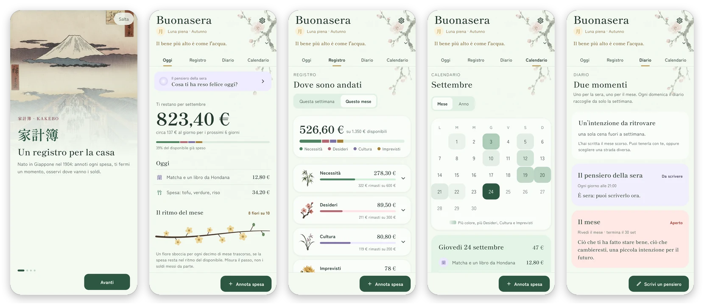

<p align="center">
  
</p>

<h1 align="center">Kakebo</h1>

<p align="center">
  <strong>家計簿 · il registro di casa giapponese, per Android</strong><br>
  Annota ogni spesa, fermati un momento, osserva dove vanno i soldi.
</p>

<p align="center">
  <a href="https://github.com/AlessioBarbanti/Kakebo/releases/latest"></a>
  <a href="https://github.com/AlessioBarbanti/Kakebo/actions/workflows/release.yml"></a>
  
  
  
</p>

<p align="center">
  <a href="https://github.com/AlessioBarbanti/Kakebo/releases/latest"><strong>Scarica l'APK</strong></a> ·
  <a href="#come-funziona">Come funziona</a> ·
  <a href="CHANGELOG.md">Novità</a> ·
  <a href="#compilare-dal-codice">Compilare</a> ·
  <a href="CONTRIBUTING.md">Contribuire</a>
</p>

<p align="center">
  
</p>

## Perché Kakebo

Il kakebo è un quaderno per le spese di casa nato in Giappone nel 1904, ideato dalla giornalista Hani Motoko. Non chiede fogli di calcolo né categorie infinite: ogni giorno si annota a mano, ogni mese ci si fa quattro domande. Scrivere rallenta, e rallentare fa vedere le proprie abitudini.

Kakebo porta quel quaderno sul telefono e ne conserva il ritmo. Prepari il mese una volta, annoti ogni giorno le spese nei quattro pilastri, e l'app ti mostra quanto ti resta, a che passo stai spendendo e dove vanno i soldi, giorno per giorno e mese per mese. A fine mese le quattro domande e un sigillo chiudono i conti, e ogni sera c'è spazio per un pensiero. Al posto di semafori rossi e notifiche allarmate ci sono carta, inchiostro e le stampe di Hiroshige: un'app che osserva con te, senza giudicare.

## Come funziona

Ogni spesa va in uno dei quattro pilastri. Ognuno ha la sua pianta, dai *quattro gentiluomini* della pittura cinese e giapponese.

|     | Pilastro   | La pianta                                  |
| --- | ---------- | ------------------------------------------ |
| 竹  | Necessità  | Il bambù: si piega ma non si spezza        |
| 梅  | Desideri   | Il susino: fiorisce quando serve gioia     |
| 蘭  | Cultura    | L'orchidea: nutre la mente in silenzio     |
| 菊  | Imprevisti | Il crisantemo: resiste al freddo inatteso  |

All'inizio e alla fine di ogni mese si risponde alle stesse quattro domande:

1. **Quanto entra questo mese?** Lo stipendio e le altre entrate; tolte le spese fisse, è quello che hai per il mese.
2. **Quanto vorresti risparmiare?** L'obiettivo, messo da parte prima di spendere.
3. **Quanto stai spendendo?** Tutto quello che annoti, pilastro per pilastro.
4. **Come puoi migliorare?** Un'intenzione per il mese che viene.

## Funzioni

- **Prepara il mese.** Entrate, spese fisse e obiettivo di risparmio: Kakebo calcola quanto resta da spendere con consapevolezza e lo divide tra i pilastri, anche con la regola 50/30/20. Il mese può cominciare il giorno dello stipendio.
- **Annota in pochi tocchi.** Importo, una nota, il pilastro. La nota suggerisce il pilastro: "cena fuori" va nei Desideri.
- **Oggi.** Quanto ti resta, circa quanto al giorno e il ramo del mese, che misura il ritmo e non il denaro.
- **Registro.** La settimana o il mese per pilastro, con quanto resta di ogni budget.
- **Calendario.** I giorni si colorano con le spese libere (Desideri, Cultura, Imprevisti) rispetto alla loro quota giornaliera, così la spesa settimanale non sembra un eccesso. La vista annuale mette ogni mese accanto al suo disponibile.
- **Diario.** Il pensiero della sera ("Cosa ti ha reso felice oggi?"), con qualche respiro guidato se lo desideri; il riepilogo della domenica; le quattro domande di fine mese e il sigillo che chiude il mese.
- **Una frase al giorno.** Trenta detti e citazioni giapponesi, con l'originale, il romaji e la fonte.
- **Un promemoria serale** all'ora che scegli.
- **In italiano e in inglese.** Valuta, date e orari seguono le impostazioni del telefono.
- **Accessibile.** Pensata per TalkBack e per il testo grande, con aree di tocco da 48 dp.

## I tuoi dati restano tuoi

Kakebo non ha account, pubblicità né statistiche d'uso, e non chiede nemmeno il permesso di accedere a Internet: tutto quello che scrivi resta sul telefono. Dalle impostazioni puoi salvare un backup completo in un file, ripristinarlo su un altro telefono ed esportare il registro in CSV per un foglio di calcolo.

## Installa

Scarica `kakebo-vX.Y.Z.apk` dall'[ultima release](https://github.com/AlessioBarbanti/Kakebo/releases/latest) e aprilo sul telefono: serve Android 7.0 o successivo, e la prima volta Android chiede di consentire l'installazione da quella fonte.

Su Google Play arriverà presto.

## Compilare dal codice

Servono [Flutter](https://docs.flutter.dev/get-started/install) 3.47 (canale stable) e l'Android SDK.

```sh
git clone https://github.com/AlessioBarbanti/Kakebo.git
cd Kakebo
flutter run          # sul telefono collegato o sull'emulatore
flutter test

# Con i dati di esempio e l'orologio fermo a una sera di settembre
flutter run --dart-define=DEMO=true --dart-define=TODAY=2026-09-24T21:30
```

La struttura del codice, le traduzioni, gli strumenti per font e immagini e la procedura di rilascio sono in [CONTRIBUTING.md](CONTRIBUTING.md).

## Crediti

- **Stampe dell'introduzione:** Utagawa Hiroshige, *Cento vedute famose di Edo* (1856–1859), pubblico dominio, da Wikimedia Commons.
- **Caratteri:** [Shippori Mincho](https://fonts.google.com/specimen/Shippori+Mincho) e [Zen Kaku Gothic New](https://fonts.google.com/specimen/Zen+Kaku+Gothic+New), sotto SIL Open Font License (testi in [`assets/fonts/`](assets/fonts/)).
- **Rametti dei pilastri e carta a inchiostro:** generati con ImageGen per Kakebo; i prompt sono in [`assets/src/botanical/PROMPTS.md`](assets/src/botanical/PROMPTS.md).
- **Campane della meditazione:** sintetizzate da [`tool/bowl.dart`](tool/bowl.dart).
